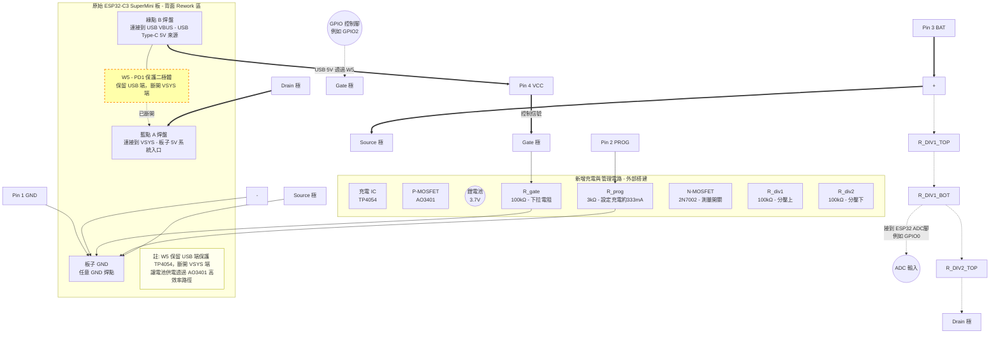

```mermaid
graph TD
    %% --- 定義區域 ---
    subgraph ORIGINAL_PCB ["原始 ESP32-C3 SuperMini 板 - 背面 Rework 區"]
        direction TB
        PAD_A["藍點 A 焊盤<br/>連接到 VSYS - 板子 5V 系統入口"]
        PAD_B["綠點 B 焊盤<br/>連接到 USB VBUS - USB Type-C 5V 來源"]
        PCB_GND["板子 GND<br/>任意 GND 焊點"]
        W5_PARTIAL["W5 - PD1 保護二極體<br/>保留 USB 端，斷開 VSYS 端"]:::modifiedStyle
        PAD_B --- W5_PARTIAL
        W5_PARTIAL -.->|已斷開| PAD_A
        
        note1["註: W5 保留 USB 端保護 TP4054，斷開 VSYS 端<br/>讓電池供電透過 AO3401 高效率路徑"]:::noteStyle
    end

    subgraph NEW_CIRCUIT ["新增充電與管理電路 - 外部搭建"]
        direction LR
        
        %% --- 元件定義 ---
        TP4054["充電 IC<br/>TP4054"]
        PMOS["P-MOSFET<br/>AO3401"]
        BAT(("鋰電池<br/>3.7V"))
        
        %% --- 電阻元件 ---
        R_PROG["R_prog<br/>3kΩ - 設定充電約333mA"]
        R_GATE["R_gate<br/>100kΩ - 下拉電阻"]
        
        %% --- 電壓測量組件 ---
        NMOS["N-MOSFET<br/>2N7002 - 測量開關"]
        R_DIV1["R_div1<br/>100kΩ - 分壓上"]
        R_DIV2["R_div2<br/>100kΩ - 分壓下"]
    end

    %% --- 連接線路 ---

    %% 1. USB 供電路徑 (紅色線: USB 5V 透過 W5 保護)
    PAD_B ==>|USB 5V 透過 W5| TP4054_VCC["Pin 4 VCC"]
    
    %% 2. TP4054 VCC 到 AO3401 Gate 控制 (橙色線: 控制信號)
    TP4054_VCC ==>|控制信號| PMOS_G["Gate 極"]

    %% 3. 系統主要供電匯流排 (紫色線: 系統輸入)
    PMOS_D["Drain 極"] ==> PAD_A

    %% 4. 電池路徑 (藍色線: 電池電壓)
    TP4054_BAT["Pin 3 BAT"] ==> BAT_POS["+"]
    BAT_POS ==> PMOS_S["Source 極"]
    BAT_POS -.-> R_DIV1_TOP

    %% 5. 接地與輔助路徑 (黑色線/虛線)
    TP4054_GND["Pin 1 GND"] --> PCB_GND
    BAT_NEG["-"] --> PCB_GND
    PMOS_G --> R_GATE --> PCB_GND
    TP4054_PROG["Pin 2 PROG"] --> R_PROG --> PCB_GND

    %% 6. 電壓測量路徑 (綠色虛線)
    R_DIV1_TOP -.-> R_DIV1_BOT
    R_DIV1_BOT -.->|"接到 ESP32 ADC腳<br/>例如 GPIO0"| ADC_PIN(("ADC 輸入"))
    R_DIV1_BOT -.-> R_DIV2_TOP
    R_DIV2_TOP -.-> NMOS_D["Drain 極"]
    NMOS_S["Source 極"] --> PCB_GND
    CTRL_PIN(("GPIO 控制腳<br/>例如 GPIO2")) -.-> NMOS_G["Gate 極"]

    %% --- 樣式設定 ---
    classDef modifiedStyle fill:#ffa,stroke:#f80,stroke-width:2px,stroke-dasharray:5 5
    classDef noteStyle fill:#ffe,stroke:#aa0,stroke-width:1px
```