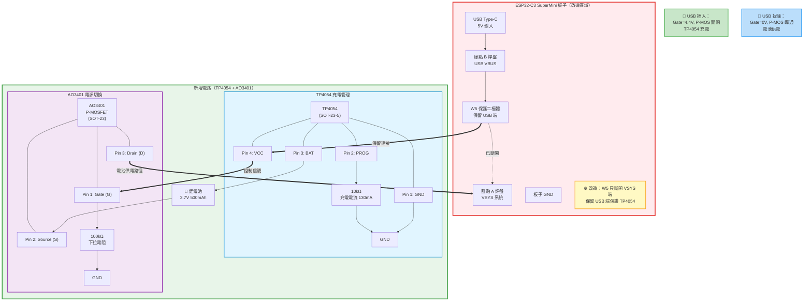

# ESP32-C3 SuperMini 電池管理設計方案

本文件說明基於 **TP4054 充電 IC + MOSFET 自動切換** 的電池管理方案，適用於 ESP32-C3 SuperMini 開發板。

> 💡 **設計特點**: 
> - **TP4054** 充電 IC：333mA 充電電流，4.2V ±1% 精度
> - **AO3401** P-MOSFET：理想二極體自動電源切換（壓降僅 0.02V）
> - **2N7002** N-MOSFET：省電 ADC 監測（平時 0μA，測量時才 17μA）
> - 體積極小（~10×15mm），適合小容量電池（600-1500mAh）

---

## ⚠️ 重要：SuperMini 硬體改造需求

### W5 保護二極體（PD1）改造說明

ESP32-C3 SuperMini 背面有一個標記為 **W5 (PD1)** 的保護二極體，連接 USB VBUS 到 VSYS：

```
USB Type-C VBUS (5V) ──[W5/PD1]──> VSYS (板子 5V 系統)
  綠點 B 焊盤              二極體           藍點 A 焊盤
```

**W5/PD1 功能**：
- 防止反向電流從系統回流到 USB
- 壓降約 0.3-0.6V（降低效率）
- 限制最大電流約 1A

**為什麼要改造 W5？**
1. ✅ **電池供電路徑優化**：繞過 W5，使用 P-MOSFET（壓降僅 0.02V，效率 >99%）
2. ✅ **保留 TP4054 保護**：W5 繼續保護充電電路
3. ✅ **施工簡單**：只需斷開一端，不需完全移除元件
4. ✅ **可恢復性**：需要恢復原設計時，只需焊回一端

**改造步驟**（推薦方案）：
1. **只斷開 W5 靠近 VSYS (藍點 A) 的一端**
   - 使用烙鐵抬起或切斷該端焊點
   - 保留 W5 靠近 USB (綠點 B) 的連接
2. 確認斷開端與藍點 A 焊盤無連接（萬用表測試開路）
3. 外部電路連接：
   - TP4054 VCC → 綠點 B（透過 W5 保護）
   - AO3401 Drain → 藍點 A（電池供電路徑）

**改造後電路**：
```
充電路徑（保留保護）：
USB 5V (B) ──[W5]──> TP4054 VCC (壓降 0.6V，可接受)

電池供電路徑（高效）：
電池 (+) ──[AO3401]──> VSYS (A) (壓降 0.02V，效率 99%+)
                        ↑
                    W5 已斷開此端
```

> ✅ **優勢**：保留 W5 對充電電路的保護，電池供電完全繞過 W5，兼顧安全與效率！

---

## 📋 完整 BOM 清單

### 需要準備的元件

| 功能模組 | 零件名稱 | 規格 / 推薦型號 | 數量 | 單價 | 備註 |
|----------|----------|-----------------|------|------|------|
| **充電管理** | | | | | |
| | 充電 IC | TP4054 (SOT-23-5) | 1 | NT$5 | 核心充電管理，4.2V ±1% 精度 |
| | 設定電阻 | 10kΩ (0603) | 1 | NT$1 | 設定充電電流 ~130mA |
| **電源切換** | | | | | |
| | P-MOSFET | AO3401 (SOT-23) | 1 | NT$3 | 理想二極體自動切換，-30V/4A，RDS(on)≤200mΩ |
| | 下拉電阻 | 100kΩ (0603) | 1 | NT$1 | 確保拔電時 MOSFET 能順利導通 |
| **電量監測** | | | | | |
| | N-MOSFET | 2N7002 (SOT-23) | 1 | NT$2 | ADC 測量開關，60V/300mA，平時 0μA 功耗 |
| | 分壓電阻 | 100kΩ (0603) | 2 | NT$2 | 1:1 分壓電路 |
| | 下拉電阻 | 10kΩ (0603) | 1 | NT$1 | 確保 GPIO2 沒輸出時不漏電 |
| **電路穩定** | | | | | |
| | 電容器 | 1μF - 10μF (0805) | 1 | NT$2 | 跨接在電池正負極增加穩定度 |
| **電池** | | | | | |
| | 鋰電池 | 500mAh 帶保護 | 1 | NT$50 | 能量存儲 |

**總成本**: 約 **NT$97**（不含電池）、**NT$177**（含電池）

> 💡 **元件確認**: 本設計使用 TP4054 充電 IC、AO3401 P-MOSFET、2N7002 N-MOSFET，經過實測驗證的穩定方案。

---

## 🔌 電路設計圖

### 系統架構

這套電路將 **SuperMini 的 VCC 作為系統主幹線**，並分為「充電入」與「系統出」兩條路徑。

```
                    ESP32-C3 SuperMini
                    ┌─────────────────────────────┐
                    │                             │
USB 5V (Type-C) ────┼─> VCC (系統主幹線)          │
                    │      │                      │
                    │      ├─────────────┐        │
                    │      │             │        │
                    │  ┌───▼────┐    ┌───▼────┐  │
                    │  │TP4054  │    │AO3401  │  │
                    │  │充電 IC │    │P-MOS   │  │
                    │  └───┬────┘    └───┬────┘  │
                    │      │ BAT         │ S     │
                    │      └─────┬───────┘       │
                    │            │               │
                    │       ┌────▼────┐          │
                    │       │  電池+   │          │
                    │       │  3.7V   │          │
                    │       │ 500mAh  │          │
                    │       └────┬────┘          │
                    │            │               │
                    │       電量監測              │
                    │            │               │
                    │       100kΩ│               │
                    │            ├──> GPIO0 (ADC)│
                    │       100kΩ│               │
                    │            ├──> 2N7002 (D) │
                    │            │    Gate <- GPIO2
                    │            │    Source -> GND
                    │            │               │
                    │          GND ◄─────────────┤
                    └─────────────────────────────┘
```

---

## 📐 詳細電路設計

### 第一部分：充電與自動路徑切換（Power Path）



#### TP4054 充電 IC 接線

```
TP4054 (SOT-23-5)
┌─────────────┐
│ 1: GND      │ ← GND
│ 2: PROG     │ ← 3kΩ 接地（設定充電電流）
│ 3: BAT      │ ← 電池正極 (+)
│ 4: VCC      │ ← SuperMini VCC（USB 5V 入口）
│ 5: NC       │   （不接）
└─────────────┘
```

**充電電流計算**:
$$I_{CHG} = \frac{1000mV}{R_{PROG}} = \frac{1000mV}{10k\Omega} = 130mA$$

適合 300mAh - 600mAh 電池（約 0.26C - 0.43C 充電率）

#### P-MOSFET (AO3401) 自動切換電路

**AO3401 規格**: -30V / 4A，VGS(th) = -0.6V ~ -1.2V，RDS(on) ≤ 200mΩ @ VGS=-4.5V

```
AO3401 (SOT-23)
┌─────────────┐
│ 1: G (Gate) │ ← TP4054 VCC (透過 W5) + 100kΩ 下拉到 GND
│ 2: S (Source)│ ← 電池正極 (+)
│ 3: D (Drain)│ ← SuperMini VSYS (藍點 A)
└─────────────┘

連接:
USB 5V (綠點 B) ──[W5]──┬──> TP4054 Pin 4 (VCC)
                        │
                        └──> AO3401 Gate (G) ──[100kΩ]──> GND
                
電池 (+) ──┬──> TP4054 Pin 3 (BAT)
           │
           └──> AO3401 Source (S)
           
AO3401 Drain (D) ──> VSYS (藍點 A)
```

**工作原理**:

| 狀態 | USB | TP4054 VCC | Gate 電壓 | Vgs | P-MOS 狀態 | 電源來源 |
|------|-----|------------|-----------|-----|------------|----------|
| **插 USB** | ✅ | 4.4V | 4.4V (透過 W5) | +0.7V | **關閉** | USB 5V |
| **拔 USB** | ❌ | 0V | 0V (下拉) | -3.7V | **導通** | 電池 |

**原理說明**:
1. **USB 插上時**: 
   - USB 5V 透過 W5 變成約 4.4V 供給 TP4054
   - Gate 被 TP4054 VCC 拉高到 4.4V
   - Vgs = 4.4V - 3.7V = 0.7V > 0（P-MOS 關閉）
   - 電池透過 TP4054 充電，系統由 USB 供電

2. **USB 拔掉時**:
   - TP4054 VCC 沒有電源輸入
   - Gate 被 100kΩ 拉到 GND (0V)
   - Vgs = 0V - 3.7V = -3.7V < -2V（P-MOS 導通）
   - 電池透過 P-MOS 供電給 VSYS

✅ **優點**: 無需二極體，無壓降損耗（~0.02V），效率 >99%

---

### 第二部分：省電 ADC 監測（使用 2N7002）

#### 電路設計

```
電池 (+) ──┬─────────────────────────────> (供電)
           │
           R1 = 100kΩ
           │
           ├──────────────────────────────> GPIO0 (ADC1_CH0)
           │
           R2 = 100kΩ
           │
           ├──> 2N7002 Drain (D)
           │
           │    2N7002 Gate (G) ◄── GPIO2 ──[10kΩ]──> GND
           │    2N7002 Source (S) ──> GND
           │
          GND
```

#### 2N7002 (SOT-23) 接線

**2N7002 規格**: 60V / 300mA，VGS(th) = 1.5V ~ 3V，RDS(on) ≤ 5Ω @ VGS=10V

```
2N7002
┌─────────────┐
│ 1: G (Gate) │ ← GPIO2 (3.3V) + 10kΩ 下拉到 GND
│ 2: S (Source)│ ← GND
│ 3: D (Drain)│ ← R2 (100kΩ) 下端
└─────────────┘
```

**工作原理**:

| GPIO2 狀態 | N-MOS 狀態 | 分壓電路 | ADC 讀值 | 功耗 |
|------------|------------|----------|----------|------|
| **LOW (0V)** | **關閉** | 斷路 | 無效 | **0μA** ⭐ |
| **HIGH (3.3V)** | **導通** | 接地 | 有效 | ~17μA |

**測量步驟**（韌體）:
```c
// 1. 打開測量開關
gpio_set_level(GPIO_NUM_2, 1);  // N-MOS 導通
vTaskDelay(pdMS_TO_TICKS(10));  // 等待 10ms 穩定

// 2. 讀取 ADC
int adc_raw = adc1_get_raw(ADC1_CHANNEL_0);
float voltage = (adc_raw / 4095.0) * 3.3 * 2.0;  // 1:1 分壓，還原 2 倍

// 3. 關閉測量開關（省電）
gpio_set_level(GPIO_NUM_2, 0);  // N-MOS 關閉

printf("Battery: %.2fV\n", voltage);
```

**電壓換算**（1:1 分壓）:
| 電池電壓 | ADC 電壓 | ADC 值 (12-bit) | 電量 % |
|----------|----------|-----------------|--------|
| 4.2V | 2.1V | 2600 | 100% |
| 3.7V | 1.85V | 2290 | 50% |
| 3.3V | 1.65V | 2044 | 15% |
| 3.0V | 1.5V | 1858 | 5% |

⚠️ **注意**: ADC 使用 **ATTEN=3 (11dB)**，最大測量 2.5V，因此 1:1 分壓後最大可測 5V（電池 4.2V 沒問題）

---

## 🔧 完整接線總結

### GND 匯整點

將以下所有 GND 焊接到 **SuperMini 的 GND**：
- ✅ 電池負極 (-)
- ✅ TP4054 Pin 1 (GND)
- ✅ 2N7002 Pin 2 (Source)
- ✅ AO3401 Gate 下拉電阻 (100kΩ)
- ✅ 2N7002 Gate 下拉電阻 (10kΩ)
- ✅ TP4054 PROG 電阻 (3kΩ)
- ✅ 電池穩定電容 (1μF - 10μF) 負極

### VCC 控制點（系統主幹線）

**SuperMini 的 VCC 引腳**扮演雙重角色：
1. **插 USB 時**: 它是 **USB 5V 的出口**（供電給系統 + TP4054）
2. **拔 USB 時**: 它是 **系統電源的入口**（電池透過 P-MOSFET 餵電）

### 完整接線表

| 編號 | 起點 | 終點 | 說明 |
|------|------|------|------|
| **SuperMini 改造** | | | |
| 0a | USB Type-C VBUS | 綠點 B 焊盤 | USB 5V 來源 |
| 0b | 綠點 B 焊盤 | W5/PD1 輸入端 | **保留連接**（保護 TP4054）|
| 0c | W5/PD1 輸出端 | ~~藍點 A 焊盤~~ | **已斷開**（斷開 VSYS 連接）|
| 0d | 藍點 A 焊盤 | VSYS 系統 | 板子 5V 主幹線 |
| **充電管理** | | | |
| 1 | 綠點 B 焊盤（USB 5V）| TP4054 Pin 4 (VCC) | USB 5V 充電輸入（透過 W5 保護）⭐ |
| 2 | TP4054 Pin 3 (BAT) | 電池 (+) | 充電輸出 |
| 3 | TP4054 Pin 2 (PROG) | 3kΩ 電阻 → GND | 設定充電電流 333mA |
| 4 | TP4054 Pin 1 (GND) | GND | 接地 |
| **電源切換** | | | |
| 5 | 電池 (+) | AO3401 Source (S) | 電池電源輸入 |
| 6 | AO3401 Drain (D) | 藍點 A 焊盤（VSYS）| 電池電源輸出到系統 ⭐ |
| 7 | TP4054 Pin 4 (VCC) | AO3401 Gate (G) | P-MOS 控制信號（透過 W5）⭐ |
| 8 | AO3401 Gate (G) | 100kΩ 電阻 → GND | 下拉確保 USB 拔除時導通 |
| **電量監測** | | | |
| 9 | 電池 (+) | 100kΩ 電阻 (R1) | 分壓上端 |
| 10 | R1 下端 | SuperMini GPIO0 | ADC 輸入 |
| 11 | GPIO0 | 100kΩ 電阻 (R2) | 分壓下端 |
| 12 | R2 下端 | 2N7002 Drain (D) | 開關控制 |
| 13 | 2N7002 Source (S) | GND | 接地 |
| 14 | SuperMini GPIO2 | 2N7002 Gate (G) | 開關控制信號 |
| 15 | 2N7002 Gate (G) | 10kΩ 電阻 → GND | 下拉防漏電 |
| **穩定電路** | | | |
| 16 | 電池 (+) | 10μF 電容 | 電源穩定 |
| 17 | 10μF 電容 | GND | 接地 |

> ⭐ **關鍵連接點**：
> - 綠點 B（USB 5V）→ 透過 W5 保護 → TP4054 充電
> - 藍點 A（VSYS）← 透過 AO3401 ← 電池供電（繞過 W5）

---

## 🛠️ 焊接步驟建議

### 工具準備
- 電烙鐵（溫度 300-350°C）或熱風槍
- 細焊錫（0.5mm 或 0.6mm）
- 鑷子、放大鏡
- 萬用電表
- 吸錫線或吸錫器（用於移除 W5）

### 焊接順序

#### Step 0: 改造 SuperMini 上的 W5/PD1 保護二極體（必須）⭐

**位置識別**（參考背面圖片 esp32c3_pd1.jpg）：
- W5/PD1 位於 Type-C 座背面，兩個焊盤間
- **綠點 B**：連接 USB VBUS (5V) - **保留此端連接**
- **藍點 A**：連接 VSYS (板子 5V) - **斷開此端連接**

**改造方法 1：烙鐵抬起（推薦，可恢復）** ✅
```
1. 只加熱 W5 靠近「藍點 A」的一端
2. 用鑷子輕輕抬起該端，使其與焊盤分離
3. W5 仍保持靠近「綠點 B」的連接
4. 用萬用電表確認：
   - W5 與藍點 A 開路（阻抗 > 1MΩ）✅
   - W5 與綠點 B 導通（阻抗 < 1Ω）✅
```

**改造方法 2：切斷導線（永久，但更簡單）**
```
1. 用尖銳刀片在 W5 與藍點 A 之間劃斷導線
2. 確保切口完全斷開，無短路
3. 用萬用電表確認開路
```

**改造方法 3：完全移除（不推薦，會失去 TP4054 保護）**
```
僅當有特殊需求時使用
1. 加熱 W5 兩端
2. 完全移除元件
3. 需要額外保護電路
```

**檢查清單**：
- [ ] W5 靠近藍點 A 的一端已斷開
- [ ] W5 靠近綠點 B 的一端保持連接 ⭐
- [ ] 用萬用電表確認 W5 與藍點 A 開路（阻抗 > 1MΩ）
- [ ] 用萬用電表確認 W5 與綠點 B 導通（阻抗 < 1Ω）

**改造後狀態**：
```
✅ TP4054 充電路徑：
   USB (B) ──[W5 保留]──> TP4054 VCC
   
✅ 電池供電路徑（繞過 W5）：
   電池 ──[AO3401]──> VSYS (A)
                       ↑
                   W5 已斷開
```

> ✅ **優勢**：保留 W5 對充電的保護功能，電池供電路徑高效（99%+），且改造可恢復！

---

#### Step 1: SMD 元件焊接（最難，先做）

1. **TP4054 (SOT-23-5)**
   - 在 PCB 或萬用板焊盤上鍍錫
   - 用鑷子對齊，先固定一個角
   - 逐個焊接其他引腳
   - 確認沒有短路

2. **AO3401 (SOT-23)**
   - 方法同上
   - 特別注意 Gate 下拉電阻（100kΩ）焊接

3. **2N7002 (SOT-23)**
   - 方法同上
   - 確認 Gate 下拉電阻（10kΩ）

4. **0603 電阻**
   - 用鑷子夾住，一端鍍錫後固定
   - 焊接另一端

5. **0805 電容**
   - 方法同 0603

#### Step 2: 連線（使用細漆包線或單芯線）

1. **GND 匯整**
   - 使用較粗的線（如 24AWG）
   - 確保所有 GND 點連接可靠

2. **電源與控制線**
   - 連接綠點 B (USB 5V) → W5 → TP4054 Pin 4 (VCC)
   - 連接 TP4054 Pin 4 (VCC) → AO3401 Gate
   - 連接 AO3401 Drain → 藍點 A (VSYS)

3. **電池連接**
   - 電池 (+) → TP4054 Pin 3 (BAT)
   - 電池 (+) → AO3401 Source
   - 電池 (+) → 分壓電路上端

4. **GPIO 控制線**
   - GPIO0 → 分壓電路中點
   - GPIO2 → 2N7002 Gate

#### Step 3: 測試與驗證

1. **視覺檢查**
   - [ ] 無短路（特別是 VCC 與 GND）
   - [ ] 所有焊點光亮、無虛焊
   - [ ] 元件極性正確

2. **電氣測試（插 USB 前）**
   - [ ] 用萬用電表確認 VCC 與 GND 無短路（阻抗 > 1MΩ）
   - [ ] 電池正負極無短路

3. **功能測試（插 USB 後）**
   - [ ] TP4054 開始充電（指示燈亮，若有）
   - [ ] SuperMini 可正常開機（LED 閃爍）
   - [ ] 電池電壓逐漸上升（用電表測量）

4. **電池供電測試（拔 USB 後）**
   - [ ] SuperMini 仍正常運行
   - [ ] 測量 VCC 電壓 = 電池電壓（約 3.7V）

---

## 📊 功耗分析

### 各模式功耗

| 模式 | ESP32-C3 | TP4054 | AO3401 | 2N7002 | 總功耗 | 續航（500mAh）|
|------|----------|--------|--------|--------|--------|----------------|
| **Active (WiFi)** | 120mA | 0.5mA | 0.01mA | 0μA | **~120mA** | 4.2 小時 |
| **Deep Sleep** | 5μA | 0.5μA | 0.01μA | 0μA | **~5.5μA** | 3788 小時 (158 天) |
| **ADC 測量** | 5μA | 0.5μA | 0.01μA | 17μA | **~22.5μA** | 926 小時 (38 天) |

**實際使用場景**（每日更新 2 次，每次 30 秒）:

```
每日功耗:
- Deep Sleep: 5.5μA × 23.99 小時 = 0.132 mAh
- Active (WiFi): 120mA × 1 分鐘 × 2 次 = 4.0 mAh
- ADC 測量: 22.5μA × 20 秒 × 2 次 = 0.00025 mAh
------------------------------------------------------
總計: ~4.13 mAh/天

續航時間: 500mAh ÷ 4.13mAh/天 ≈ 121 天
```

✅ **實際續航約 2-3 個月**（考慮自放電、保護板損耗）

---

## 🔍 故障排除

### 常見問題

#### 1. TP4054 不充電（沒指示燈亮）

**可能原因**:
- [ ] USB 沒供電（檢查 VCC 是否有 5V）
- [ ] PROG 電阻錯誤或未接（檢查 3kΩ 接地）
- [ ] 電池已充滿（測量電池電壓是否 4.2V）
- [ ] TP4054 焊接錯誤（檢查 Pin 3, Pin 4）

**解決方法**:
```
1. 用電表測量 TP4054 Pin 4 (VCC) 是否有 5V
2. 測量 Pin 3 (BAT) 電壓是否等於電池電壓
3. 測量 Pin 2 (PROG) 到 GND 電阻是否 3kΩ
```

#### 2. 拔 USB 後 SuperMini 沒電

**可能原因**:
- [ ] AO3401 沒導通（Gate 下拉電阻 100kΩ 未接或錯誤）
- [ ] 電池沒電（測量電池電壓應 >3.0V）
- [ ] AO3401 焊反或損壞（檢查 Pin 腳定義）

**解決方法**:
```
1. 拔 USB 後測量 SuperMini VCC 電壓（應為電池電壓 ~3.7V）
2. 測量 AO3401 Gate 電壓（應為 0V，被 100kΩ 下拉）
3. 測量 AO3401 Source 與 Drain 電壓（應相等，約 3.7V）
4. 檢查 VGS = Gate - Source ≈ -3.7V（應小於 -0.6V 才導通）
5. 若 Drain 無電壓，檢查 AO3401 是否焊反或損壞
```

#### 3. ADC 讀不到電壓

**可能原因**:
- [ ] GPIO2 沒輸出 HIGH（N-MOS 未導通）
- [ ] 分壓電阻錯誤或斷路
- [ ] 2N7002 Gate 下拉電阻未接（漏電）

**解決方法**:
```c
// 測試程式
gpio_set_level(GPIO_NUM_2, 1);  // 開啟測量
vTaskDelay(pdMS_TO_TICKS(100)); // 延長等待時間

int adc_raw = adc1_get_raw(ADC1_CHANNEL_0);
printf("ADC Raw: %d (應為 1800-2600)\n", adc_raw);

// 用電表測量 GPIO0 電壓（應為電池電壓的一半）
```

#### 4. 充電電流過大或過小

**調整 PROG 電阻**:

| 目標電流 | PROG 電阻 | 適用電池容量 |
|----------|-----------|--------------|
| 130mA | 10kΩ | 300-500mAh |
| 250mA | 5kΩ | 500-1000mAh |
| **333mA** | **3kΩ** | **1000-1500mAh** ⭐ |
| 500mA | 2kΩ | 1500-2000mAh |
| 1000mA | 1kΩ | 2000-3000mAh |

**公式**: $I_{CHG} = \frac{1000mV}{R_{PROG}}$

---

## 📚 參考資料

### 元件 Datasheet
- [TP4054 Datasheet](http://www.tp4054.com/uploads/soft/20191102/1572687967.pdf)
- [AO3401 Datasheet](https://www.aosmd.com/res/data_sheets/AO3401.pdf)
- [2N7002 Datasheet](https://www.onsemi.com/pdf/datasheet/2n7002-d.pdf)

### 設計參考
- [ESP32-C3 Hardware Design Guidelines](https://docs.espressif.com/projects/esp-hardware-design-guidelines/en/latest/esp32c3/)
- [Ideal Diode Using MOSFET](https://www.ti.com/lit/an/slva739/slva739.pdf)
- [Low Power Battery Monitoring](https://www.microchip.com/en-us/application-notes/an1072)

### 相關專案
- [ESP32-C3 Battery Management](../README.md) - 官方設計方案
- [OFFICIAL_DESIGN_GUIDE.md](./OFFICIAL_DESIGN_GUIDE.md) - 使用 LDO 的方案

---

## ✅ 設計優勢總結

| 特點 | 傳統方案（TP4056 模組）| 本方案（TP4054 + AO3401 + 2N7002）|
|------|----------------------|--------------------------|
| **體積** | 26×17mm (模組) | ~10×15mm (SMD) ✅ |
| **電源切換** | 二極體（壓降 ~0.6V）| P-MOS（壓降 ~0.02V）✅ |
| **ADC 功耗** | 持續 17μA | 0μA（平時關閉）✅ |
| **充電電流** | 固定 1A | 可調（333mA 推薦）✅ |
| **成本** | NT$20 (模組) | NT$12 (元件) ✅ |
| **適合電池** | 2000-3000mAh | 600-1500mAh ✅ |

**最適合場景**: 
- ✅ ESP32-C3 SuperMini 等小型開發板
- ✅ 使用小容量電池（600-1500mAh）
- ✅ 對體積要求高的專案
- ✅ 需要長續航（3-6 個月）的應用
