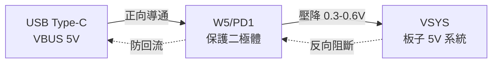
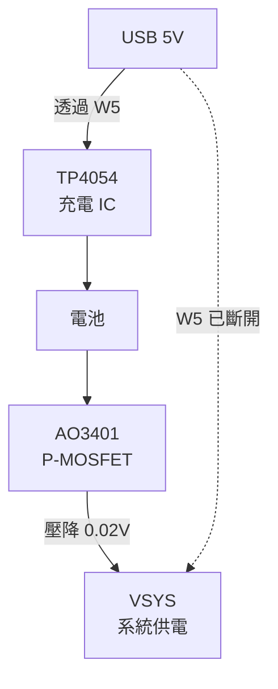

# ESP32-C3 SuperMini W5/PD1 改造指南

> ⚠️ **已廢棄 / DEPRECATED**  
> 本文件描述的 W5/PD1 改造方案已不再推薦使用。  
> **新設計已改為保留 W5/PD1 完整不修改**，無需進行任何硬體改造。  
> 請參考 [SUPERMINI_BATTERY_DESIGN.md](./SUPERMINI_BATTERY_DESIGN.md) 了解最新設計方案。
>
> **原因**：保持開發板原始狀態可降低風險、保持保固，並簡化施工流程。

---

## 歷史參考資訊

以下內容僅作為歷史參考，**不建議實施**：

本文件說明如何改造 ESP32-C3 SuperMini 背面的 W5（標記為 PD1）保護二極體，**只斷開 VSYS 端**，保留充電保護功能的同時實現高效電池供電。

> 💡 **新設計優勢**：只斷開 W5 的 VSYS 端，保留 USB 端連接，兼顧安全與效率！

---

## 📍 W5/PD1 元件識別

### 位置與功能

參考圖片：`esp32c3_pd1.jpg`

```
ESP32-C3 SuperMini 背面（Type-C 座附近）

        Type-C 座
            │
        ┌───┴───┐
        │       │
        │  USB  │
        └───┬───┘
            │
         W5/PD1 保護二極體
      ┌─────┴─────┐
      │           │
  B 焊盤       A 焊盤
  (綠點)       (藍點)
      │           │
   USB 5V      VSYS
   VBUS        板子 5V
```

### 元件標記

| 標記 | 功能 | 規格 |
|------|------|------|
| **W5** | 絲印標記 | PCB 上的元件編號 |
| **PD1** | 電路符號 | Protection Diode 1 |
| **綠點 B** | 輸入端 | 連接 USB VBUS (5V) |
| **藍點 A** | 輸出端 | 連接 VSYS (板子 5V 系統) |

---

## 🔍 W5/PD1 的作用

### 原始設計功能



**保護功能**：
1. ✅ 防止電流從系統反向流回 USB
2. ✅ 簡單、成本低
3. ❌ 壓降大（0.3-0.6V）
4. ❌ 功耗高（發熱）
5. ❌ 限制電流約 1A

### 新設計：保留 W5 + P-MOSFET 並行



**新設計優勢**：
1. ✅ **保留充電保護**：W5 繼續保護 TP4054 充電路徑
2. ✅ **高效電池供電**：電池透過 P-MOSFET 供電（壓降僅 0.02V，效率 >99%）
3. ✅ **施工簡單**：只需斷開或抬起 W5 的一端
4. ✅ **可恢復性**：需要恢復原設計時，只需焊回一端
5. ✅ **兼顧安全與效率**：兩全其美的設計

---

## 🛠️ W5/PD1 改造步驟

### 方法 1：烙鐵抬起單端（推薦，可恢復）✅

**所需工具**：
- 電烙鐵（30-60W）
- 鑷子
- 萬用電表

**步驟**：

1. **預熱烙鐵**
   ```
   溫度設定: 320-350°C
   等待穩定: 約 2 分鐘
   ```

2. **識別 W5 位置與方向**
   ```
   - 翻轉板子，背面朝上
   - 找到 Type-C 座附近的 W5
      
   Type-C ── W5 ── VSYS
       B端(綠)   A端(藍)
       保留      斷開此端 ✂️
   ```

3. **只加熱 W5 靠近藍點 A 的一端**
   ```
   - 用烙鐵只加熱靠近藍點 A 的焊點
   - 加熱時間 3-5 秒
   ```

4. **抬起元件一端**
   ```
   - 用鑷子輕輕抬起 W5 靠近藍點 A 的一端
   - W5 另一端（綠點 B 端）保持焊接
   - 抬起高度約 1-2mm 即可
   ```

5. **確認改造結果**
   ```
   - W5 一端抬起，與藍點 A 分離
   - W5 另一端仍連接綠點 B
   - 元件未損壞，可隨時焊回
   ```

---

### 方法 2：切斷走線（永久，但最簡單）

**所需工具**：
- 尖銳刀片或美工刀
- 萬用電表

**步驟**：

1. **識別目標走線**
   ```
   - 找到 W5 與藍點 A (VSYS) 之間的銅箔走線
   - 這條線通常很細（約 0.3-0.5mm）
   ```

2. **小心切斷走線**
   ```
   - 用刀片在走線中間輕輕刮除銅箔
   - 深度只需刮掉銅箔即可，不要傷到 PCB 基板
   - 確保切口完全斷開
   ```

3. **檢查切斷結果**
   ```
   - 用萬用電表確認 W5 與藍點 A 開路
   - 確認沒有銅箔殘留造成短路
   ```

**優點**：
- ✅ 最簡單，不需加熱
- ✅ 不會損壞元件
- ✅ 精確控制

**缺點**：
- ❌ 無法輕易恢復（需要飛線）

---

### 方法 3：完全移除（不推薦，會失去充電保護）

**僅在特殊需求時使用**（例如：需要完整的焊盤空間）

**所需工具**：
- 熱風槍或烙鐵 + 吸錫線
- 鑷子
- 萬用電表

**步驟**：

1. **熱風槍方法**
   ```
   溫度: 300-350°C
   風速: 中等
   加熱 W5 兩端 10-15 秒
   用鑷子取下元件
   ```

2. **烙鐵方法**
   ```
   同時加熱 W5 兩端焊點
   用鑷子拉起元件
   清理殘留焊錫
   ```

**缺點**：
- ❌ TP4054 失去反向保護
- ❌ 施工較複雜
- ❌ 需要重焊元件才能恢復

---

## ✅ 改造後檢查清單

### 視覺檢查

**方法 1（抬起單端）檢查項目**：
- [ ] **W5 VSYS 端（藍點 A 側）**
  - 已抬起或斷開
  - 元件本體完整
  - 與藍點 A 焊盤無接觸

- [ ] **W5 USB 端（綠點 B 側）**
  - 保持焊接連接 ✅
  - 焊點牢固
  - 無虛焊

- [ ] **周圍元件**
  - 無損傷
  - 無位移
  - 無短路

**方法 2（切斷走線）檢查項目**：
- [ ] **切斷走線**
  - 銅箔完全斷開
  - 無殘留短路
  - 切口整齊

- [ ] **W5 元件**
  - 保持完整
  - 兩端都有焊接
  - 元件未受損

**方法 3（完全移除）檢查項目**：
- [ ] **焊盤狀態**
  - 藍點 A 暴露完整
  - 綠點 B 暴露完整
  - 表面平整無氧化

### 電氣測試（萬用電表）

**關鍵測試**（適用所有方法）：

1. **W5 VSYS 端斷開測試** ⭐
   ```
   測試: W5 元件 VSYS 側 ↔ 藍點 A 焊盤
   預期: 開路（阻抗 > 1MΩ）
   ✅ 表示: 成功斷開連接
   ```

2. **W5 USB 端連接測試** ⭐
   ```
   測試: W5 元件 USB 側 ↔ 綠點 B 焊盤
   預期: 導通（阻抗 < 1Ω）
   ✅ 表示: 保留連接正常
   ```

3. **USB 到 VSYS 隔離測試**
   ```
   測試: 綠點 B (USB) ↔ 藍點 A (VSYS)
   預期: 開路（阻抗 > 1MΩ）
   ✅ 表示: USB 與 VSYS 已隔離
   ```

4. **W5 到 TP4054 路徑測試**（接線後）
   ```
   測試: W5 元件 ↔ TP4054 VCC 焊點
   預期: 導通（阻抗 < 1Ω）
   ✅ 表示: 充電路徑保持完整
   ```

---

## ⚠️ 重要注意事項

### 改造後的板子狀態

```
✅ 改進 1: 充電路徑保留保護
   - USB → W5 → TP4054 → 電池
   - W5 繼續提供反向保護
   - 充電安全性不受影響

✅ 改進 2: 電池供電高效化
   - 電池 → AO3401 → VSYS
   - 完全繞過 W5 的壓降
   - 效率從 90% 提升到 99%+

⚠️ 注意: 改造後需外部電路
   - 必須搭配 TP4054 + AO3401
   - 不能單獨插 USB 使用
```

### 安全提醒

1. **烙鐵溫度**
   - 不要超過 380°C
   - 避免長時間加熱（< 5 秒）
   - 防止 PCB 過熱變形

2. **熱風槍使用**
   - 保持適當距離
   - 避免吹到周圍元件
   - 注意周圍易燃物

3. **靜電防護**
   - 使用防靜電手環
   - 在防靜電墊上操作

4. **工作環境**
   - 通風良好
   - 照明充足
   - 工作台穩固

---

## 📸 圖片參考

### W5/PD1 位置圖

參考圖片：`esp32c3_pd1.jpg`

**標記說明**：
- 🔴 **W5 紅框**：待移除的保護二極體
- 🔵 **藍點 A**：連接 VSYS（板子 5V 系統）
- 🟢 **綠點 B**：連接 USB VBUS（USB 5V）

### 移除前後對比

```
┌─────────────────────┐       ┌─────────────────────┐
│   移除前              │       │   移除後              │
│                      │       │                      │
│  B ──[W5]── A       │       │  B         A        │
│  🟢   二極  🔵      │  ══>  │  🟢        🔵       │
│      體              │       │  (空焊盤) (空焊盤)   │
│                      │       │                      │
│ USB ──> 系統         │       │ USB  X  系統         │
└─────────────────────┘       └─────────────────────┘
```

---

## 🔄 如果移除失敗怎麼辦？

### 焊盤損壞修復

如果不小心刮傷焊盤：
1. 使用銅箔膠帶修補
2. 或直接飛線連接到 USB 5V 和系統 5V

### 元件裝回（不建議）

如果想恢復原樣：
1. 購買相同規格的 SMD 二極體（SS14 或類似）
2. 焊接回原位
3. 測試 USB 供電功能

---

## 📚 相關文件

- [SUPERMINI_BATTERY_DESIGN.md](./SUPERMINI_BATTERY_DESIGN.md) - 完整電池管理設計
- [HW_Design_1.md](./HW_Design_1.md) - 硬體電路圖（Mermaid）
- [WIRING_DIAGRAM.md](../hardware/WIRING_DIAGRAM.md) - 詳細接線圖

---

## 💡 FAQ

### Q1: 為什麼不完全移除 W5？
**A**: 保留 W5 可以繼續保護 TP4054 充電電路，防止反向電流，更安全可靠。

### Q2: 只斷開一端會影響充電嗎？
**A**: 不會。充電路徑是 USB → W5 → TP4054，W5 的 USB 端保持連接，充電功能完全正常。

### Q3: 改造後插 USB 會怎樣？
**A**: 完成外部電路後，插 USB 可正常充電和供電。斷開前請先完成 TP4054 + AO3401 電路。

### Q4: 改造可以恢復嗎？
**A**: 可以！
- 方法 1（抬起）：直接焊回即可
- 方法 2（切斷）：需要飛線或銅箔修復
- 方法 3（移除）：重新焊接 W5 或類似二極體

### Q5: 改造會失去保固嗎？
**A**: 是的。任何硬體改造都會失去保固。請自行承擔風險。

### Q6: 哪種方法最推薦？
**A**: 方法 1（抬起單端）最推薦，因為：
- 可輕易恢復
- 元件無損
- 操作簡單

---

**最後更新**: 2026-01-08  
**版本**: v1.0
