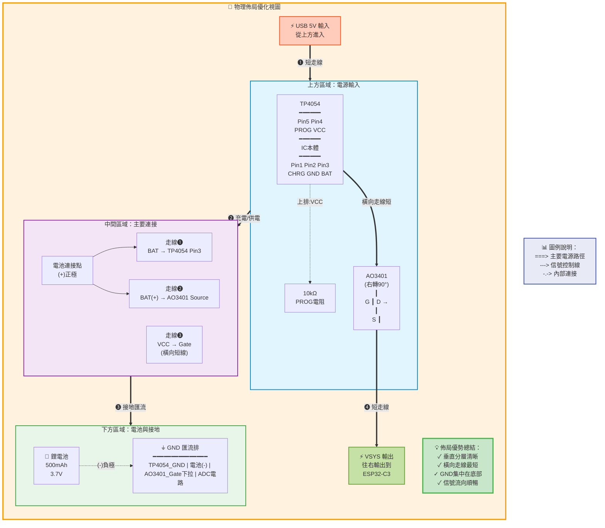
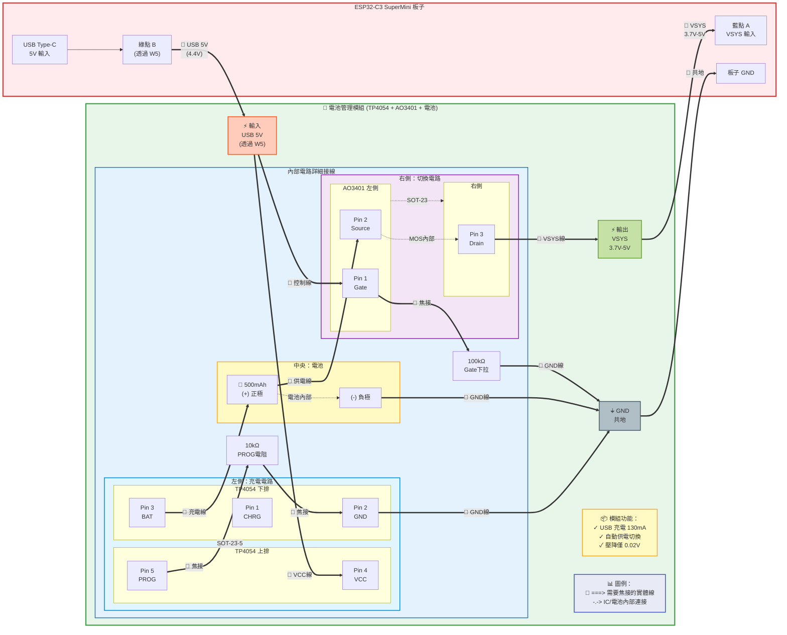
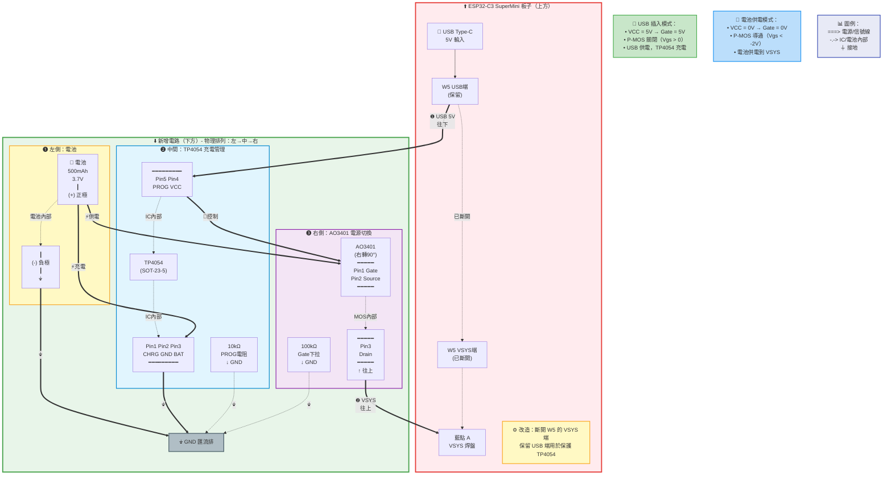
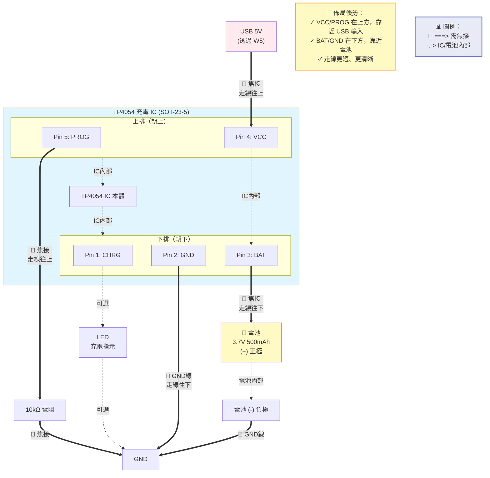
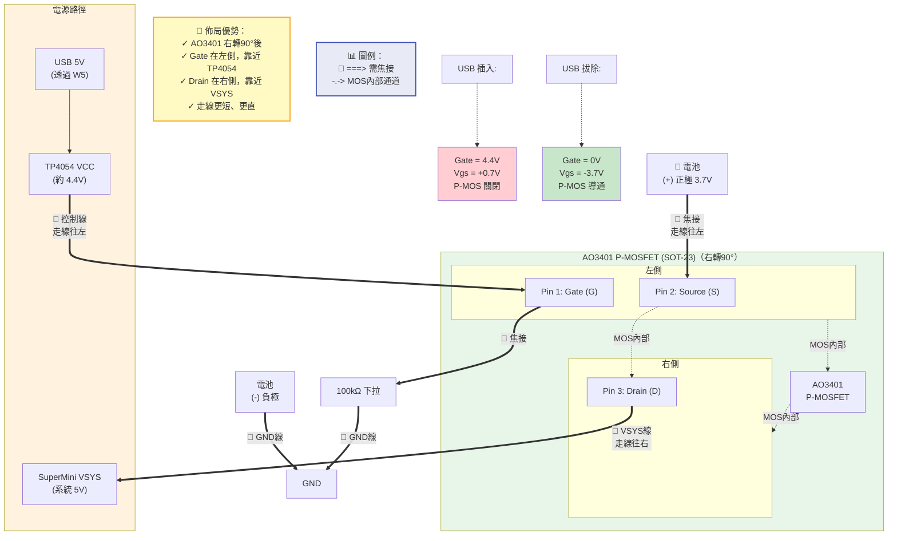

# ESP32-C3 SuperMini 電池管理接線圖

本文件提供基於 **TP4054 + MOSFET 自動切換**方案的詳細接線圖與檢查清單。

> 📌 **適用開發板**: ESP32-C3 SuperMini（或其他小型 ESP32-C3 開發板）

---

## 🎯 硬體配置

### GPIO 使用規劃

| GPIO | 功能 | 說明 |
|------|------|------|
| **GPIO0** | ADC (電量監測) | ADC1_CH0，讀取分壓後的電池電壓 |
| **GPIO2** | 測量開關控制 | 控制 N-MOSFET (2N7002) 導通/關閉 |
| VCC | 系統主幹線 | USB/電池自動切換入口 |
| GND | 系統接地 | 所有 GND 匯整點 |

### 與 E-Paper 專案兼容性

**SPI E-Paper 連接**（沿用 esp32c3_spi_display）:
| GPIO | E-Paper | 說明 |
|------|---------|------|
| GPIO2 | SCLK | SPI 時脈 ⚠️ 與 ADC 控制衝突 |
| GPIO3 | MOSI | SPI 數據 |
| GPIO10 | CS | 片選 |
| GPIO4 | DC | 數據/命令選擇 |
| GPIO5 | RST | 重置 |
| GPIO6 | BUSY | 忙碌狀態 |

> ⚠️ **GPIO 衝突解決**: 
> - **若使用 E-Paper**: 將 ADC 控制改用 GPIO1 或 GPIO7
> - **若不用 E-Paper**: 維持使用 GPIO2 控制 ADC

---

## 📐 完整接線圖（TP4054 + MOSFET）

### 🎨 優化佈局說明

為了讓電路走線更精簡、焊接更容易，採用以下元件配置：

**TP4054 放置方式**：
- **上排（Pin 5, 4）**：PROG 和 VCC 朝上，靠近 USB 輸入
- **下排（Pin 1, 2, 3）**：CHRG、GND、BAT 朝下，靠近電池

**AO3401 放置方式**：
- **右轉90°順時針**：放置在電路板右側
- **左側引腳（Pin 1, 2）**：Gate 和 Source 朝左，靠近 TP4054 和電池
- **右側引腳（Pin 3）**：Drain 朝右，靠近 VSYS 輸出

**佈局優勢**：
✓ USB 5V → VCC 走線短（從上方進入 TP4054）  
✓ 電池 (+) → BAT/Source 走線短（從下方連接）  
✓ Gate 控制線短（TP4054 VCC → AO3401 Gate 橫向直連）  
✓ VSYS 輸出線短（AO3401 Drain 直接往右到 VSYS）  
✓ GND 匯流更集中（TP4054、AO3401、電池的 GND 都在下方）



**ASCII 佈局視圖（補充）**：
```
優化佈局視圖：
                                                      
    USB 5V ──────────┐                               
                     ↓                               
    ┌────────────────────────────────┐              
    │      TP4054 (左側)             │              
    │  ┌──────────────────┐          │              
    │  │  Pin5   Pin4     │          │     到 VSYS →
    │  │  PROG   VCC      │ ←──────┐ │              
    │  │      IC本體       │        │ │     AO3401   
    │  │  Pin1 Pin2 Pin3  │        │ │   ┌────┐     
    │  │  CHRG GND  BAT   │ ───┐   └─┼───┤G  D├──→  
    │  └──────┬───┬───┬───┘    │     │   │    │     
    │         │   │   │        │     │   │S   │     
    │        LED  GND  └────────┼─────┼───┤    │     
    │         │        電池(+)  │     │   └────┘     
    │         │          │      │     │    右轉90°   
    │         │       ┌──▼──┐   │     │              
    │         │       │ 🔋  │   │     │              
    │         │       │500mA│   │     │              
    │         │       └──┬──┘   │     │              
    │         │          │(-)   │     │              
    └─────────┴──────────┴──────┴─────┘              
              GND匯流區                              
```

---

### 系統架構圖

```
                    ESP32-C3 SuperMini
                    ┌─────────────────────────────┐
                    │                             │
USB 5V (Type-C) ────┼─> VCC (系統主幹線)          │
                    │      │                      │
                    │      ├─────────────┐        │
                    │      │             │        │
                    │  ┌───▼────┐    ┌───▼────┐  │
                    │  │TP4054  │    │AO3401  │  │
                    │  │充電 IC │    │P-MOS   │  │
                    │  └───┬────┘    └───┬────┘  │
                    │      │ BAT         │ S     │
                    │      └─────┬───────┘       │
                    │            │               │
                    │       ┌────▼────┐          │
                    │       │🔋 電池   │          │
                    │       │ (+) 正極 │          │
                    │       │ 500mAh   │          │
                    │       │ (-) 負極 │          │
                    │       └────┬────┘          │
                    │            │               │
                    │       電量監測              │
                    │            │               │
                    │       100kΩ│               │
                    │            ├──> GPIO0 (ADC)│
                    │       100kΩ│               │
                    │            ├──> 2N7002 (D) │
                    │            │    Gate <- GPIO2
                    │            │    Source -> GND
                    │            │               │
                    │          GND ◄─────────────┤
                    └─────────────────────────────┘
```

### 模組化視圖（電池管理模組）

將 **TP4054 + AO3401 + 電池** 視為一個完整的電池管理模組，對外只有 3 個接口：



**模組接口說明**：

| 接口 | 類型 | 連接目標 | 說明 |
|------|------|----------|------|
| **USB 5V** | 輸入 | SuperMini 綠點 B (透過 W5) | USB 供電輸入，約 4.4V |
| **VSYS** | 輸出 | SuperMini 藍點 A | 系統供電輸出，3.7V-5V |
| **GND** | 接地 | SuperMini GND | 共地 |

**模組內部接線細節**：

1. **TP4054 充電管理**
   - Pin 4 (VCC) ← USB 5V 輸入
   - Pin 3 (BAT) → 電池正極
   - Pin 5 (PROG) → 10kΩ 電阻 → GND（設定充電電流 130mA）
   - Pin 2 (GND) → GND
   - Pin 1 (CHRG) → 充電指示 LED（可選）

2. **AO3401 電源切換**
   - Pin 1 (Gate) ← TP4054 VCC + 100kΩ 下拉到 GND
   - Pin 2 (Source) ← 電池正極
   - Pin 3 (Drain) → VSYS 輸出

3. **電池連接**
   - 正極 (+) → TP4054 BAT & AO3401 Source
   - 負極 (-) → GND

**模組工作模式**：

### 整體電路架構（TP4054 + AO3401）



---

### 詳細接線步驟

#### Step 1: TP4054 充電 IC



**文字說明**:
```
TP4054 (SOT-23-5) 接線（優化佈局）:

上排（Pin 5, 4）：靠近 USB 輸入
┌─────────────┐
│ 5: PROG     │ ← 10kΩ 接地（設定充電電流 130mA）
│ 4: VCC      │ ← SuperMini VCC（USB 5V 入口，透過 W5）
├─────────────┤
│   TP4054    │
│   IC 本體   │
├─────────────┤
│ 1: CHRG     │ ← 充電指示 LED（可選）
│ 2: GND      │ ← GND
│ 3: BAT      │ ← 電池正極 (+)
└─────────────┘
下排（Pin 1, 2, 3）：靠近電池

連接:
1. Pin 4 (VCC) ──> USB 5V (透過 W5 保護)
2. Pin 3 (BAT) ──> 電池 (+)
3. Pin 5 (PROG) ──> 10kΩ 電阻 ──> GND
4. Pin 2 (GND) ──> GND
5. Pin 1 (CHRG) ──> LED ──> GND（可選）

充電電流計算:
I_CHG = 1000mV / 10kΩ = 130mA (適合 500mAh 電池，0.26C 充電率)
```

#### Step 2: P-MOSFET (AO3401) 自動切換



**文字說明**:
```
AO3401 (SOT-23) 接線（右轉90°佈局）:

       左側              右側
    ┌────────┐      ┌────────┐
    │ 1: G   │      │        │
    │ (Gate) │<---- │        │
    │        │      │ 3: D   │----> VSYS
    │ 2: S   │<---- │(Drain) │
    │(Source)│ 電池 │        │
    └────────┘      └────────┘
       AO3401 (旋轉後視圖)

連接方式：
左側（輸入）：靠近 TP4054 和電池
- Pin 1 (Gate) ← TP4054 VCC（透過 W5，約 4.4V）+ 100kΩ 下拉到 GND
- Pin 2 (Source) ← 電池正極 (+)

右側（輸出）：靠近 VSYS
- Pin 3 (Drain) → SuperMini VSYS
└─────────────┘

連接:
1. Source (S) ──> 電池 (+)
2. Drain (D) ──> SuperMini VSYS (系統主幹線)
3. Gate (G) ──> TP4054 VCC (透過 W5)
4. Gate (G) ──> 100kΩ 電阻 ──> GND

工作原理:
✅ USB 插入: Gate = 4.4V, Vgs = +0.7V → P-MOS 關閉 (USB 供電)
✅ USB 拔除: Gate = 0V, Vgs = -3.7V → P-MOS 導通 (電池供電)
✅ 壓降極低: RDS(on) ≤ 200mΩ，壓降約 0.02V，效率 >99%
```

#### Step 3: N-MOSFET (2N7002) 省電 ADC


**文字說明**:
```
2N7002 (SOT-23) 接線:
┌─────────────┐
│ 1: G (Gate) │ ← GPIO2 + 10kΩ 下拉到 GND
│ 2: S (Source)│ ← GND
│ 3: D (Drain)│ ← 分壓電路下端 (R2)
└─────────────┘

分壓電路 (1:1 分壓):
電池 (+) ──┬── 100kΩ (R1) ──┬── GPIO0 (ADC)
           │                │
           │                └── 100kΩ (R2) ──┬── 2N7002 Drain (D)
           │                                 │
           └─────────────────────────────────┘

控制邏輯:
Gate (G) ──> GPIO2 ──[10kΩ]──> GND
Source (S) ──> GND

工作原理:
⚡ 省電模式: GPIO2 = LOW → N-MOS 關閉 → ADC 斷路 → 0μA
📊 測量模式: GPIO2 = HIGH → N-MOS 導通 → ADC 接地 → 17μA
💡 測量步驟:
   1. GPIO2 拉高 (N-MOS 導通)
   2. 延遲 10ms 穩定
   3. 讀取 GPIO0 ADC
   4. GPIO2 拉低 (N-MOS 關閉，省電)

電壓換算:
ADC 讀值 → ADC 電壓 (0-2.5V) → 電池電壓 × 2 (1:1 分壓)
```

#### Step 4: 穩定電容


**文字說明**:
```
電池穩定:
電池 (+) ──┬── 10μF 電容 ──┬── GND
           │              │
           └──────────────┘

作用: 
✓ 增加電源穩定度
✓ 抑制瞬態電流
✓ 減少 ESP32-C3 WiFi 傳輸時的電壓波動
```

---

## � 完整接線表

### 所有連接（共 17 條）

| 編號 | 起點 | 終點 | 說明 |
|------|------|------|------|
| **充電管理** | | | |
| 1 | SuperMini VCC | TP4054 Pin 4 (VCC) | USB 5V 輸入 |
| 2 | TP4054 Pin 3 (BAT) | 電池 (+) | 充電輸出 |
| 3 | TP4054 Pin 2 (PROG) | 3kΩ 電阻 → GND | 設定充電電流 |
| 4 | TP4054 Pin 1 (GND) | GND | 接地 |
| **電源切換** | | | |
| 5 | 電池 (+) | AO3401 Source (S) | 電池電源輸入 |
| 6 | AO3401 Drain (D) | SuperMini VCC | 電池電源輸出 |
| 7 | SuperMini VCC | AO3401 Gate (G) | 控制信號 |
| 8 | AO3401 Gate (G) | 100kΩ 電阻 → GND | 下拉確保導通 |
| **電量監測** | | | |
| 9 | 電池 (+) | 100kΩ 電阻 (R1) | 分壓上端 |
| 10 | R1 下端 | SuperMini GPIO0 | ADC 輸入 |
| 11 | GPIO0 | 100kΩ 電阻 (R2) | 分壓下端 |
| 12 | R2 下端 | 2N7002 Drain (D) | 開關控制 |
| 13 | 2N7002 Source (S) | GND | 接地 |
| 14 | SuperMini GPIO2 | 2N7002 Gate (G) | 開關控制信號 |
| 15 | 2N7002 Gate (G) | 10kΩ 電阻 → GND | 下拉防漏電 |
| **穩定電路** | | | |
| 16 | 電池 (+) | 10μF 電容 | 電源穩定 |
| 17 | 10μF 電容 | GND | 接地 |

---

## 🔍 與 E-Paper 專案整合

### GPIO 分配規劃

**電池管理使用**:
- GPIO0: ADC 電量監測（ADC1_CH0）
- GPIO2: 控制 N-MOSFET 開關

**E-Paper SPI 使用**:
- GPIO2: SCLK（SPI 時脈）⚠️ **衝突**
- GPIO3: MOSI
- GPIO4: DC
- GPIO5: RST
- GPIO6: BUSY
- GPIO10: CS

### 衝突解決方案

#### 選項 1: 修改 E-Paper GPIO（推薦）

將 E-Paper 的 SCLK 改用其他 GPIO：

```
修改後的 E-Paper 連接:
GPIO7  : SCLK (改用 GPIO7) ✅
GPIO3  : MOSI
GPIO4  : DC
GPIO5  : RST
GPIO6  : BUSY
GPIO10 : CS

電池管理維持:
GPIO0  : ADC (電量監測)
GPIO2  : 控制 N-MOSFET ✅
```

#### 選項 2: 修改電池管理 GPIO

將 N-MOSFET 控制改用其他 GPIO：

```
電池管理修改:
GPIO0  : ADC (電量監測)
GPIO1  : 控制 N-MOSFET (改用 GPIO1) ✅

E-Paper 維持原樣:
GPIO2  : SCLK ✅
GPIO3  : MOSI
GPIO4  : DC
GPIO5  : RST
GPIO6  : BUSY
GPIO10 : CS
```

**推薦使用選項 2**（修改電池管理較簡單）

---

## ✅ 檢查清單

### 焊接前檢查

#### 元件準備
- [ ] TP4054 (SOT-23-5) × 1
- [ ] AO3401 (SOT-23) × 1
- [ ] 2N7002 (SOT-23) × 1
- [ ] 10kΩ 電阻 (0603) × 1  ⭐ PROG 電阻，設定充電電流 130mA
- [ ] 100kΩ 電阻 (0603) × 3
- [ ] 10kΩ 電阻 (0603) × 1  ⭐ N-MOSFET Gate 下拉
- [ ] 10μF 電容 (0805) × 1
- [ ] 鋰聚電池 500mAh（帶保護板）× 1

#### 工具準備
- [ ] 電烙鐵（溫度 300-350°C）
- [ ] 細焊錫（0.5mm 或 0.6mm）
- [ ] 鑷子、放大鏡
- [ ] 萬用電表
- [ ] 細漆包線或單芯線

### 焊接後檢查

#### 視覺檢查
- [ ] 所有焊點光亮、無虛焊
- [ ] SMD 元件無歪斜、焊錫適量
- [ ] 無短路（特別是相鄰引腳）
- [ ] 元件極性正確（MOSFET 方向）

#### 電氣測試（插 USB 前）
- [ ] VCC 與 GND 無短路（阻抗 > 1MΩ）
- [ ] 電池正負極無短路
- [ ] TP4054 各引腳對地阻抗正常

### 上電測試

#### USB 供電測試
- [ ] 插入 USB，SuperMini VCC = 5V
- [ ] TP4054 開始充電（電池電壓上升）
- [ ] SuperMini 可正常開機（LED 閃爍）
- [ ] AO3401 Gate = 5V（P-MOS 關閉，電池不供電）

#### 電池供電測試（拔 USB）
- [ ] 拔除 USB，SuperMini 仍正常運行
- [ ] SuperMini VCC = 電池電壓（約 3.7V）
- [ ] AO3401 Gate = 0V（P-MOS 導通，電池供電）

#### ADC 測量測試
- [ ] GPIO2 = LOW 時，ADC 讀值無效（N-MOS 關閉）
- [ ] GPIO2 = HIGH 時，ADC 讀值 1800-2600（N-MOS 導通）
- [ ] ADC 電壓 ≈ 電池電壓 / 2（1:1 分壓）

---

## 🧪 測試程式

### 省電 ADC 測量測試

```c
// test_battery_voltage_mosfet.ino
#include "driver/adc.h"
#include "driver/gpio.h"

#define ADC_GPIO    GPIO_NUM_0    // ADC 輸入
#define MOSFET_GPIO GPIO_NUM_2    // N-MOSFET 控制

void setup() {
    Serial.begin(115200);
    delay(1000);
    
    // 配置 ADC
    adc1_config_width(ADC_WIDTH_BIT_12);
    adc1_config_channel_atten(ADC1_CHANNEL_0, ADC_ATTEN_DB_11); // 0-2500mV
    
    // 配置 MOSFET 控制 GPIO
    gpio_set_direction(MOSFET_GPIO, GPIO_MODE_OUTPUT);
    gpio_set_level(MOSFET_GPIO, 0); // 預設關閉（省電）
    
    Serial.println("ESP32-C3 省電電池監測測試");
}

void loop() {
    // 1. 開啟測量開關
    gpio_set_level(MOSFET_GPIO, 1);  // N-MOS 導通
    delay(10);  // 等待 10ms 穩定
    
    // 2. 讀取 ADC
    int raw = adc1_get_raw(ADC1_CHANNEL_0);
    
    // 3. 關閉測量開關（省電）
    gpio_set_level(MOSFET_GPIO, 0);  // N-MOS 關閉
    
    // 4. 換算電壓（1:1 分壓）
    float voltage_adc = (raw / 4095.0) * 2.5;  // ATTEN=3 最大 2.5V
    float battery_voltage = voltage_adc * 2.0;  // 1:1 分壓，還原 2 倍
    
    // 5. 電量百分比（簡化線性）
    float percentage = (battery_voltage - 3.0) / (4.2 - 3.0) * 100.0;
    percentage = constrain(percentage, 0, 100);
    
    Serial.printf("ADC Raw: %d, ADC V: %.2fV, Battery: %.2fV (%.0f%%)\n",
                  raw, voltage_adc, battery_voltage, percentage);
    
    delay(10000);  // 每 10 秒測量一次（平時 N-MOS 關閉，0μA）
}
```

### 自動切換測試

```c
// test_power_switch.ino

void setup() {
    Serial.begin(115200);
    delay(1000);
    Serial.println("USB/電池自動切換測試");
    Serial.println("請插拔 USB，觀察系統是否持續運行");
}

void loop() {
    // 檢查 VCC 電壓（若有 ADC 監測）
    // 或簡單地持續輸出，確認系統穩定
    Serial.println("系統正常運行...");
    delay(1000);
}
```

---

## 📸 實體照片參考（文字描述）

### TP4056 模組識別

```
典型 TP4056 模組外觀:
- 尺寸: 約 26×17mm
- 有 2 顆 LED（紅色 + 藍色/綠色）
- 6 個焊盤或接腳:
  * IN+/IN-: USB 輸入（通常有 Micro USB 座）
  * B+/B-: 電池連接（通常標示 BAT+ BAT-）
  * OUT+/OUT-: 負載輸出

判斷是否有保護板:
- 看模組背面是否有 DW01A 或 FS8205A 等 IC
- 或標示 "with protection"
```

### 麵包板佈局建議

```
推薦佈局（由左至右）:
1. 電池座（左側，方便更換）
2. TP4056（中間，方便接線）
3. ESP32-C3（右側，方便 USB 連接與觀察）

分壓電阻放置:
- 靠近 ESP32-C3 的 GPIO0
- 使用彩色杜邦線區分（紅 = Vbat, 黑 = GND, 黃 = ADC）
```

---

## ⚠️ 常見問題

### Q1: TP4056 OUT+ 直接接 ESP32-C3 3V3 安全嗎？
**A**: 看開發板設計：
- 大多數開發板（如 ESP32-C3-DevKitM-1）有板載 LDO，可承受 3.0V-6.0V 輸入，安全
- 若使用裸晶片（ESP32-C3-MINI-1），電池滿電 4.2V 超出規格 3.6V，需加 LDO

**測試方法**: 
1. 先用三用電表測量 TP4056 OUT+ 電壓
2. 若 > 3.6V，加 MCP1700-3.3
3. 若 3.0V-3.6V，可直接連接

### Q2: 分壓電路的電阻可以用其他值嗎？
**A**: 可以，但需滿足：
1. 總阻抗 > 50kΩ（減少漏電流）
2. 分壓比約 1:3（將 4.2V 降至 1.0V 左右）

**常用替代方案**:
- 150kΩ + 47kΩ（分壓比 1:3.2）
- 220kΩ + 68kΩ（分壓比 1:3.2，更省電）

### Q3: 沒有 TP4056 的 CHRG/STDBY 引腳怎麼辦？
**A**: 部分便宜模組沒有引出這兩個腳位，可以：
1. 不接，僅用 ADC 監測電量（推薦）
2. 改用有引腳的模組（貴 NT$5-10）

---

## 📚 參考資源

- [ESP32-C3 Pinout](https://docs.espressif.com/projects/esp-idf/en/latest/esp32c3/hw-reference/esp32c3/user-guide-devkitm-1.html)
- [TP4056 接線教學](https://randomnerdtutorials.com/esp32-lipo-battery-charging-usb/)
- [ADC 校準範例](https://docs.espressif.com/projects/esp-idf/en/latest/esp32c3/api-reference/peripherals/adc_calibration.html)
