# ESP32-C3 SuperMini 電池管理接線圖

本文件提供基於 **TP4054 + MOSFET 自動切換**方案的詳細接線圖與檢查清單。

> 📌 **適用開發板**: ESP32-C3 SuperMini（或其他小型 ESP32-C3 開發板）

---

## 🎯 硬體配置

### GPIO 使用規劃

| GPIO | 功能 | 說明 |
|------|------|------|
| **GPIO0** | ADC (電量監測) | ADC1_CH0，讀取分壓後的電池電壓 |
| **GPIO2** | 測量開關控制 | 控制 N-MOSFET (2N7002) 導通/關閉 |
| VCC | 系統主幹線 | USB/電池自動切換入口 |
| GND | 系統接地 | 所有 GND 匯整點 |

### 與 E-Paper 專案兼容性

**SPI E-Paper 連接**（沿用 esp32c3_spi_display）:
| GPIO | E-Paper | 說明 |
|------|---------|------|
| GPIO2 | SCLK | SPI 時脈 ⚠️ 與 ADC 控制衝突 |
| GPIO3 | MOSI | SPI 數據 |
| GPIO10 | CS | 片選 |
| GPIO4 | DC | 數據/命令選擇 |
| GPIO5 | RST | 重置 |
| GPIO6 | BUSY | 忙碌狀態 |

> ⚠️ **GPIO 衝突解決**: 
> - **若使用 E-Paper**: 將 ADC 控制改用 GPIO1 或 GPIO7
> - **若不用 E-Paper**: 維持使用 GPIO2 控制 ADC

---

## 📐 完整接線圖（TP4054 + MOSFET）

### 系統架構圖

```
                    ESP32-C3 SuperMini
                    ┌─────────────────────────────┐
                    │                             │
USB 5V (Type-C) ────┼─> VCC (系統主幹線)          │
                    │      │                      │
                    │      ├─────────────┐        │
                    │      │             │        │
                    │  ┌───▼────┐    ┌───▼────┐  │
                    │  │TP4054  │    │AO3401  │  │
                    │  │充電 IC │    │P-MOS   │  │
                    │  └───┬────┘    └───┬────┘  │
                    │      │ BAT         │ S     │
                    │      └─────┬───────┘       │
                    │            │               │
                    │       ┌────▼────┐          │
                    │       │  電池+   │          │
                    │       │  500mAh  │          │
                    │       └────┬────┘          │
                    │            │               │
                    │       電量監測              │
                    │            │               │
                    │       100kΩ│               │
                    │            ├──> GPIO0 (ADC)│
                    │       100kΩ│               │
                    │            ├──> 2N7002 (D) │
                    │            │    Gate <- GPIO2
                    │            │    Source -> GND
                    │            │               │
                    │          GND ◄─────────────┤
                    └─────────────────────────────┘
```

### 詳細接線步驟

#### Step 1: TP4054 充電 IC

```mermaid
graph LR
    subgraph TP4054["TP4054 充電 IC (SOT-23-5)"]
        PIN1["Pin 1: GND"]
        PIN2["Pin 2: PROG"]
        PIN3["Pin 3: BAT"]
        PIN4["Pin 4: VCC"]
        PIN5["Pin 5: NC"]
    end
    
    USB["USB 5V<br/>(透過 W5)"] -->|供電| PIN4
    PIN4 -->|充電輸出| PIN3
    PIN3 --> BAT["電池正極 (+)<br/>3.7V 500mAh"]
    PIN2 --> R_PROG["10kΩ 電阻"]
    R_PROG --> GND1["GND"]
    PIN1 --> GND1
    
    style TP4054 fill:#e1f5ff
    style BAT fill:#fff9c4
    style USB fill:#ffebee
```



**文字說明**:
```
TP4054 (SOT-23-5) 接線:
┌─────────────┐
│ 1: GND      │ ← GND
│ 2: PROG     │ ← 10kΩ 接地（設定充電電流 130mA）
│ 3: BAT      │ ← 電池正極 (+)
│ 4: VCC      │ ← SuperMini VCC（USB 5V 入口，透過 W5）
│ 5: NC       │   （不接）
└─────────────┘

連接:
1. Pin 4 (VCC) ──> USB 5V (透過 W5 保護)
2. Pin 3 (BAT) ──> 電池 (+)
3. Pin 2 (PROG) ──> 10kΩ 電阻 ──> GND
4. Pin 1 (GND) ──> GND

充電電流計算:
I_CHG = 1000mV / 10kΩ = 130mA (適合 500mAh 電池，0.26C 充電率)
```

#### Step 2: P-MOSFET (AO3401) 自動切換

```mermaid
graph TB
    subgraph POWER_PATH["電源路徑"]
        USB5V["USB 5V<br/>(透過 W5)"] 
        TP4054_VCC["TP4054 VCC<br/>(約 4.4V)"]
        VSYS["SuperMini VSYS<br/>(系統 5V)"]
    end
    
    subgraph AO3401["AO3401 P-MOSFET (SOT-23)"]
        GATE["Pin 1: Gate (G)"]
        SOURCE["Pin 2: Source (S)"]
        DRAIN["Pin 3: Drain (D)"]
    end
    
    BAT_P["電池正極 (+)<br/>3.7V"] --> SOURCE
    SOURCE -.->|P-MOS 導通時| DRAIN
    DRAIN --> VSYS
    
    USB5V --> TP4054_VCC
    TP4054_VCC -->|控制信號| GATE
    GATE --> R_GATE["100kΩ 下拉"]
    R_GATE --> GND2["GND"]
    
    USB_ON["USB 插入:"] -.-> STATE1["Gate = 4.4V<br/>Vgs = +0.7V<br/>P-MOS 關閉"]
    USB_OFF["USB 拔除:"] -.-> STATE2["Gate = 0V<br/>Vgs = -3.7V<br/>P-MOS 導通"]
    
    style AO3401 fill:#e8f5e9
    style POWER_PATH fill:#fff3e0
    style STATE1 fill:#ffcdd2
    style STATE2 fill:#c8e6c9
```



**文字說明**:
```
AO3401 (SOT-23) 接線:
┌─────────────┐
│ 1: G (Gate) │ ← TP4054 VCC (透過 W5，約 4.4V) + 100kΩ 下拉到 GND
│ 2: S (Source)│ ← 電池正極 (+)
│ 3: D (Drain)│ ← SuperMini VSYS
└─────────────┘

連接:
1. Source (S) ──> 電池 (+)
2. Drain (D) ──> SuperMini VSYS (系統主幹線)
3. Gate (G) ──> TP4054 VCC (透過 W5)
4. Gate (G) ──> 100kΩ 電阻 ──> GND

工作原理:
✅ USB 插入: Gate = 4.4V, Vgs = +0.7V → P-MOS 關閉 (USB 供電)
✅ USB 拔除: Gate = 0V, Vgs = -3.7V → P-MOS 導通 (電池供電)
✅ 壓降極低: RDS(on) ≤ 200mΩ，壓降約 0.02V，效率 >99%
```

#### Step 3: N-MOSFET (2N7002) 省電 ADC

```mermaid
graph TB
    BAT_P2["電池正極 (+)<br/>3.0V - 4.2V"] --> R1["R1: 100kΩ<br/>分壓上"]
    R1 --> MID["中點電壓<br/>1.5V - 2.1V"]
    MID --> GPIO0["GPIO0<br/>(ADC1_CH0)"]
    MID --> R2["R2: 100kΩ<br/>分壓下"]
    R2 --> DRAIN
    
    subgraph NMOS["2N7002 N-MOSFET (SOT-23)"]
        GATE2["Pin 1: Gate (G)"]
        SOURCE2["Pin 2: Source (S)"]
        DRAIN["Pin 3: Drain (D)"]
    end
    
    GPIO2["GPIO2<br/>(控制開關)"] --> GATE2
    GATE2 --> R_GATE2["10kΩ 下拉"]
    R_GATE2 --> GND3["GND"]
    SOURCE2 --> GND3
    
    DRAIN -.->|N-MOS 導通時| SOURCE2
    
    subgraph STATES["工作模式"]
        OFF["省電模式:<br/>GPIO2 = LOW<br/>N-MOS 關閉<br/>ADC 斷路<br/>功耗: 0μA"]
        ON["測量模式:<br/>GPIO2 = HIGH<br/>N-MOS 導通<br/>ADC 接地<br/>功耗: 17μA"]
    end
    
    style NMOS fill:#e1bee7
    style GPIO0 fill:#fff59d
    style GPIO2 fill:#81c784
    style OFF fill:#ffcdd2
    style ON fill:#c8e6c9
```



**文字說明**:
```
2N7002 (SOT-23) 接線:
┌─────────────┐
│ 1: G (Gate) │ ← GPIO2 + 10kΩ 下拉到 GND
│ 2: S (Source)│ ← GND
│ 3: D (Drain)│ ← 分壓電路下端 (R2)
└─────────────┘

分壓電路 (1:1 分壓):
電池 (+) ──┬── 100kΩ (R1) ──┬── GPIO0 (ADC)
           │                │
           │                └── 100kΩ (R2) ──┬── 2N7002 Drain (D)
           │                                 │
           └─────────────────────────────────┘

控制邏輯:
Gate (G) ──> GPIO2 ──[10kΩ]──> GND
Source (S) ──> GND

工作原理:
⚡ 省電模式: GPIO2 = LOW → N-MOS 關閉 → ADC 斷路 → 0μA
📊 測量模式: GPIO2 = HIGH → N-MOS 導通 → ADC 接地 → 17μA
💡 測量步驟:
   1. GPIO2 拉高 (N-MOS 導通)
   2. 延遲 10ms 穩定
   3. 讀取 GPIO0 ADC
   4. GPIO2 拉低 (N-MOS 關閉，省電)

電壓換算:
ADC 讀值 → ADC 電壓 (0-2.5V) → 電池電壓 × 2 (1:1 分壓)
```

#### Step 4: 穩定電容

```mermaid
graph LR
    BAT_P3["電池正極 (+)"] --> CAP["10μF 電容<br/>(0805)"]  
    CAP --> GND4["GND"]
    
    NOTE["作用:<br/>✓ 增加電源穩定度<br/>✓ 抑制瞬態電流<br/>✓ 減少電壓波動"]
    
    style CAP fill:#b3e5fc
    style NOTE fill:#fff9c4
```



**文字說明**:
```
電池穩定:
電池 (+) ──┬── 10μF 電容 ──┬── GND
           │              │
           └──────────────┘

作用: 
✓ 增加電源穩定度
✓ 抑制瞬態電流
✓ 減少 ESP32-C3 WiFi 傳輸時的電壓波動
```

---

## � 完整接線表

### 所有連接（共 17 條）

| 編號 | 起點 | 終點 | 說明 |
|------|------|------|------|
| **充電管理** | | | |
| 1 | SuperMini VCC | TP4054 Pin 4 (VCC) | USB 5V 輸入 |
| 2 | TP4054 Pin 3 (BAT) | 電池 (+) | 充電輸出 |
| 3 | TP4054 Pin 2 (PROG) | 3kΩ 電阻 → GND | 設定充電電流 |
| 4 | TP4054 Pin 1 (GND) | GND | 接地 |
| **電源切換** | | | |
| 5 | 電池 (+) | AO3401 Source (S) | 電池電源輸入 |
| 6 | AO3401 Drain (D) | SuperMini VCC | 電池電源輸出 |
| 7 | SuperMini VCC | AO3401 Gate (G) | 控制信號 |
| 8 | AO3401 Gate (G) | 100kΩ 電阻 → GND | 下拉確保導通 |
| **電量監測** | | | |
| 9 | 電池 (+) | 100kΩ 電阻 (R1) | 分壓上端 |
| 10 | R1 下端 | SuperMini GPIO0 | ADC 輸入 |
| 11 | GPIO0 | 100kΩ 電阻 (R2) | 分壓下端 |
| 12 | R2 下端 | 2N7002 Drain (D) | 開關控制 |
| 13 | 2N7002 Source (S) | GND | 接地 |
| 14 | SuperMini GPIO2 | 2N7002 Gate (G) | 開關控制信號 |
| 15 | 2N7002 Gate (G) | 10kΩ 電阻 → GND | 下拉防漏電 |
| **穩定電路** | | | |
| 16 | 電池 (+) | 10μF 電容 | 電源穩定 |
| 17 | 10μF 電容 | GND | 接地 |

---

## 🔍 與 E-Paper 專案整合

### GPIO 分配規劃

**電池管理使用**:
- GPIO0: ADC 電量監測（ADC1_CH0）
- GPIO2: 控制 N-MOSFET 開關

**E-Paper SPI 使用**:
- GPIO2: SCLK（SPI 時脈）⚠️ **衝突**
- GPIO3: MOSI
- GPIO4: DC
- GPIO5: RST
- GPIO6: BUSY
- GPIO10: CS

### 衝突解決方案

#### 選項 1: 修改 E-Paper GPIO（推薦）

將 E-Paper 的 SCLK 改用其他 GPIO：

```
修改後的 E-Paper 連接:
GPIO7  : SCLK (改用 GPIO7) ✅
GPIO3  : MOSI
GPIO4  : DC
GPIO5  : RST
GPIO6  : BUSY
GPIO10 : CS

電池管理維持:
GPIO0  : ADC (電量監測)
GPIO2  : 控制 N-MOSFET ✅
```

#### 選項 2: 修改電池管理 GPIO

將 N-MOSFET 控制改用其他 GPIO：

```
電池管理修改:
GPIO0  : ADC (電量監測)
GPIO1  : 控制 N-MOSFET (改用 GPIO1) ✅

E-Paper 維持原樣:
GPIO2  : SCLK ✅
GPIO3  : MOSI
GPIO4  : DC
GPIO5  : RST
GPIO6  : BUSY
GPIO10 : CS
```

**推薦使用選項 2**（修改電池管理較簡單）

---

## ✅ 檢查清單

### 焊接前檢查

#### 元件準備
- [ ] TP4054 (SOT-23-5) × 1
- [ ] AO3401 (SOT-23) × 1
- [ ] 2N7002 (SOT-23) × 1
- [ ] 10kΩ 電阻 (0603) × 1  ⭐ PROG 電阻，設定充電電流 130mA
- [ ] 100kΩ 電阻 (0603) × 3
- [ ] 10kΩ 電阻 (0603) × 1  ⭐ N-MOSFET Gate 下拉
- [ ] 10μF 電容 (0805) × 1
- [ ] 鋰聚電池 500mAh（帶保護板）× 1

#### 工具準備
- [ ] 電烙鐵（溫度 300-350°C）
- [ ] 細焊錫（0.5mm 或 0.6mm）
- [ ] 鑷子、放大鏡
- [ ] 萬用電表
- [ ] 細漆包線或單芯線

### 焊接後檢查

#### 視覺檢查
- [ ] 所有焊點光亮、無虛焊
- [ ] SMD 元件無歪斜、焊錫適量
- [ ] 無短路（特別是相鄰引腳）
- [ ] 元件極性正確（MOSFET 方向）

#### 電氣測試（插 USB 前）
- [ ] VCC 與 GND 無短路（阻抗 > 1MΩ）
- [ ] 電池正負極無短路
- [ ] TP4054 各引腳對地阻抗正常

### 上電測試

#### USB 供電測試
- [ ] 插入 USB，SuperMini VCC = 5V
- [ ] TP4054 開始充電（電池電壓上升）
- [ ] SuperMini 可正常開機（LED 閃爍）
- [ ] AO3401 Gate = 5V（P-MOS 關閉，電池不供電）

#### 電池供電測試（拔 USB）
- [ ] 拔除 USB，SuperMini 仍正常運行
- [ ] SuperMini VCC = 電池電壓（約 3.7V）
- [ ] AO3401 Gate = 0V（P-MOS 導通，電池供電）

#### ADC 測量測試
- [ ] GPIO2 = LOW 時，ADC 讀值無效（N-MOS 關閉）
- [ ] GPIO2 = HIGH 時，ADC 讀值 1800-2600（N-MOS 導通）
- [ ] ADC 電壓 ≈ 電池電壓 / 2（1:1 分壓）

---

## 🧪 測試程式

### 省電 ADC 測量測試

```c
// test_battery_voltage_mosfet.ino
#include "driver/adc.h"
#include "driver/gpio.h"

#define ADC_GPIO    GPIO_NUM_0    // ADC 輸入
#define MOSFET_GPIO GPIO_NUM_2    // N-MOSFET 控制

void setup() {
    Serial.begin(115200);
    delay(1000);
    
    // 配置 ADC
    adc1_config_width(ADC_WIDTH_BIT_12);
    adc1_config_channel_atten(ADC1_CHANNEL_0, ADC_ATTEN_DB_11); // 0-2500mV
    
    // 配置 MOSFET 控制 GPIO
    gpio_set_direction(MOSFET_GPIO, GPIO_MODE_OUTPUT);
    gpio_set_level(MOSFET_GPIO, 0); // 預設關閉（省電）
    
    Serial.println("ESP32-C3 省電電池監測測試");
}

void loop() {
    // 1. 開啟測量開關
    gpio_set_level(MOSFET_GPIO, 1);  // N-MOS 導通
    delay(10);  // 等待 10ms 穩定
    
    // 2. 讀取 ADC
    int raw = adc1_get_raw(ADC1_CHANNEL_0);
    
    // 3. 關閉測量開關（省電）
    gpio_set_level(MOSFET_GPIO, 0);  // N-MOS 關閉
    
    // 4. 換算電壓（1:1 分壓）
    float voltage_adc = (raw / 4095.0) * 2.5;  // ATTEN=3 最大 2.5V
    float battery_voltage = voltage_adc * 2.0;  // 1:1 分壓，還原 2 倍
    
    // 5. 電量百分比（簡化線性）
    float percentage = (battery_voltage - 3.0) / (4.2 - 3.0) * 100.0;
    percentage = constrain(percentage, 0, 100);
    
    Serial.printf("ADC Raw: %d, ADC V: %.2fV, Battery: %.2fV (%.0f%%)\n",
                  raw, voltage_adc, battery_voltage, percentage);
    
    delay(10000);  // 每 10 秒測量一次（平時 N-MOS 關閉，0μA）
}
```

### 自動切換測試

```c
// test_power_switch.ino

void setup() {
    Serial.begin(115200);
    delay(1000);
    Serial.println("USB/電池自動切換測試");
    Serial.println("請插拔 USB，觀察系統是否持續運行");
}

void loop() {
    // 檢查 VCC 電壓（若有 ADC 監測）
    // 或簡單地持續輸出，確認系統穩定
    Serial.println("系統正常運行...");
    delay(1000);
}
```

---

## 📸 實體照片參考（文字描述）

### TP4056 模組識別

```
典型 TP4056 模組外觀:
- 尺寸: 約 26×17mm
- 有 2 顆 LED（紅色 + 藍色/綠色）
- 6 個焊盤或接腳:
  * IN+/IN-: USB 輸入（通常有 Micro USB 座）
  * B+/B-: 電池連接（通常標示 BAT+ BAT-）
  * OUT+/OUT-: 負載輸出

判斷是否有保護板:
- 看模組背面是否有 DW01A 或 FS8205A 等 IC
- 或標示 "with protection"
```

### 麵包板佈局建議

```
推薦佈局（由左至右）:
1. 電池座（左側，方便更換）
2. TP4056（中間，方便接線）
3. ESP32-C3（右側，方便 USB 連接與觀察）

分壓電阻放置:
- 靠近 ESP32-C3 的 GPIO0
- 使用彩色杜邦線區分（紅 = Vbat, 黑 = GND, 黃 = ADC）
```

---

## ⚠️ 常見問題

### Q1: TP4056 OUT+ 直接接 ESP32-C3 3V3 安全嗎？
**A**: 看開發板設計：
- 大多數開發板（如 ESP32-C3-DevKitM-1）有板載 LDO，可承受 3.0V-6.0V 輸入，安全
- 若使用裸晶片（ESP32-C3-MINI-1），電池滿電 4.2V 超出規格 3.6V，需加 LDO

**測試方法**: 
1. 先用三用電表測量 TP4056 OUT+ 電壓
2. 若 > 3.6V，加 MCP1700-3.3
3. 若 3.0V-3.6V，可直接連接

### Q2: 分壓電路的電阻可以用其他值嗎？
**A**: 可以，但需滿足：
1. 總阻抗 > 50kΩ（減少漏電流）
2. 分壓比約 1:3（將 4.2V 降至 1.0V 左右）

**常用替代方案**:
- 150kΩ + 47kΩ（分壓比 1:3.2）
- 220kΩ + 68kΩ（分壓比 1:3.2，更省電）

### Q3: 沒有 TP4056 的 CHRG/STDBY 引腳怎麼辦？
**A**: 部分便宜模組沒有引出這兩個腳位，可以：
1. 不接，僅用 ADC 監測電量（推薦）
2. 改用有引腳的模組（貴 NT$5-10）

---

## 📚 參考資源

- [ESP32-C3 Pinout](https://docs.espressif.com/projects/esp-idf/en/latest/esp32c3/hw-reference/esp32c3/user-guide-devkitm-1.html)
- [TP4056 接線教學](https://randomnerdtutorials.com/esp32-lipo-battery-charging-usb/)
- [ADC 校準範例](https://docs.espressif.com/projects/esp-idf/en/latest/esp32c3/api-reference/peripherals/adc_calibration.html)
